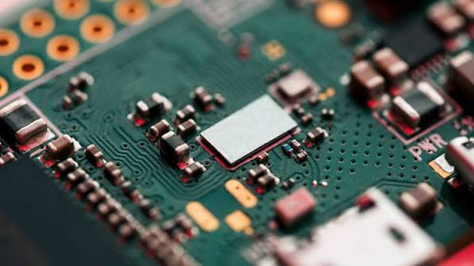

Producción Electrónica es una materia enfocada en el diseño y la fabricación de componentes electrónicos desde cero, partiendo del planteamiento inicial del proyecto. Abarca desde la elaboración de esquemáticos y el diseño de placas, hasta el uso de herramientas y software especializado para el corte, soldado y ensamblaje, con el objetivo de construir una placa 100% funcional.

## Objetivos de la materia
1. Diseño y corte inicial: Aprender a utilizar KiCad y MODS para diseñar una primera placa electrónica, operando VPanel para el corte de la placa.

2. Ensamblaje y técnicas: Explorar herramientas adicionales y perfeccionar las técnicas de soldadura y construcción física de circuitos.

3. Proyecto: Aplicar todas las habilidades desarrolladas en el diseño y construcción de un sistema funcional y bien estructurado.
