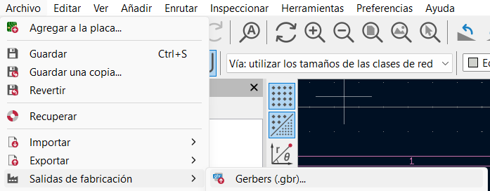
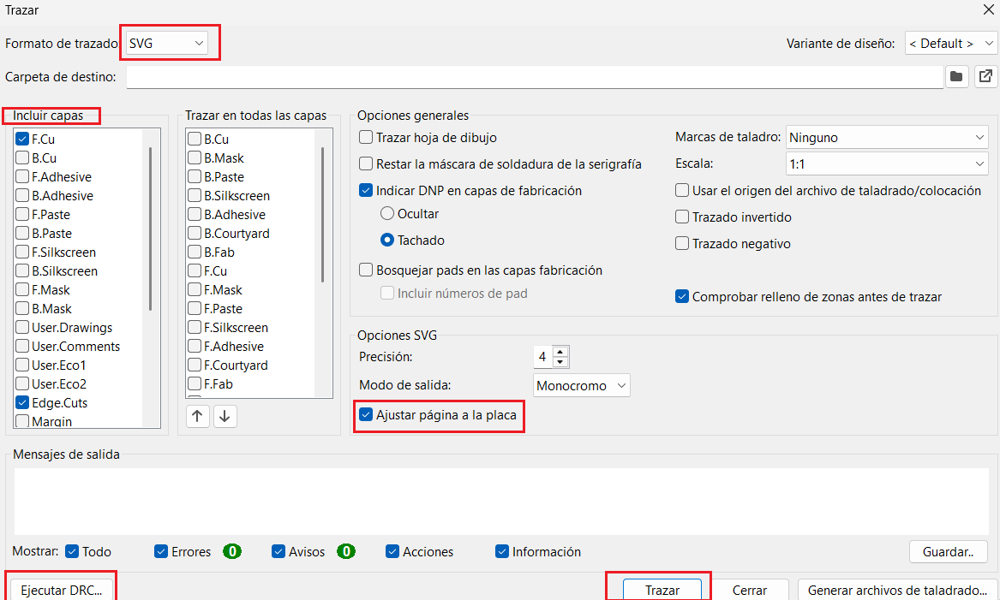

{ width="250" style="display: block; margin: 0 auto;" }

KiCad es un programa gratuito y de código abierto que se usa para diseñar componentes electrónicos, desde los esquemáticos hasta las placas de circuito impreso (PCB). Es una de las herramientas más usadas en el mundo de la electrónica, tanto por su facilidad de uso como por ser completamente gratuita. A continuación, se detalla paso a paso cómo utilizarla.

## Introducción a KiCad

{ width="800" style="display: block; margin: 0 auto;" }

Al iniciar el programa, se presenta la página principal, la cual está dividida en cuatro secciones fundamentales para el flujo de trabajo: Proyectos Recientes, Editor de Esquemáticos, Editor de Placas y Herramientas. Estas son las áreas esenciales que utilizaremos durante el desarrollo de cualquier diseño.

## Herramientas

{ width="350" style="display: block; margin: 0 auto;" }

La sección de Herramientas nos permite ampliar las capacidades del software mediante el Administrador de Complementos y Contenido, dándonos acceso a un catálogo amplio y variado de recursos muy útiles para nuestros proyectos.

{ width="800" style="display: block; margin: 0 auto;" }

Para incorporar nuevas librerías, debemos acceder a la sección de Repositorios y luego a Bibliotecas, donde buscaremos específicamente la biblioteca "KiCad FabLib". Para instalarla, simplemente entramos a ese repositorio, hacemos clic en "Instalar" y posteriormente en "Aplicar Cambios Pendientes". Por último, es necesario reiniciar la aplicación para que los nuevos recursos aparezcan disponibles en la sección de esquemáticos.

## Editor de Esquemáticos

{ width="800" style="display: block; margin: 0 auto;" }

{ width="300" style="display: block; margin: 0 auto;" }

Al ingresar al editor de esquemáticos, dispondremos de una barra lateral en el costado izquierdo que concentra todas las funciones necesarias para estructurar nuestro circuito.

{ width="800" style="display: block; margin: 0 auto;" }

Dentro de nuestros proyectos se recomienda utilizar componentes de tamaño 1206. Al haber instalado previamente la librería FabLib, bastará con buscar "1206" para localizar fácilmente los componentes compatibles con este tamaño. Asimismo, es indispensable verificar que cada componente incorporado en el esquemático cuente con su respectiva huella (blueprint).

{ width="400" style="display: block; margin: 0 auto;" }

{ width="1000" style="display: block; margin: 0 auto;" }

Una vez finalizado el circuito, el resultado ideal debe mostrar todas las conexiones debidamente realizadas, los componentes etiquetados, los pines de entrada y salida definidos, así como las alimentaciones de voltaje y tierra claramente establecidas. Cuando el diseño esté listo, debemos hacer clic en el ícono de verificación (checklist) ubicado en la barra superior para ejecutar una prueba ERC (Electrical Rules Check), la cual detectará posibles errores en el esquemático. Los únicos avisos normales o esperados en esta prueba suelen ser aquellos que indican que las tierras y voltajes no están conectados a nada externamente. Una vez superado este paso, hacemos clic en el botón situado en el extremo derecho de la barra superior para pasar del esquemático al editor de placas.

## Editor de Placas

{ width="800" style="display: block; margin: 0 auto;" }

La página principal del editor de placas muestra inicialmente todos los componentes agrupados en un mismo punto, los cuales debemos acomodar de forma ordenada según la distribución física que deseemos para nuestra placa. No obstante, antes de realizar las conexiones, es fundamental configurar las tolerancias y las medidas de las pistas.

{ width="300" style="display: block; margin: 0 auto;" }

{ width="500" style="display: block; margin: 0 auto;" }

{ width="800" style="display: block; margin: 0 auto;" }

En la esquina superior izquierda, se va a ver un menú que va a decir "Pista: usar el ancho de clase de red". Al abrir ese menú, se puede desplegar para modificar las configuraciones que la placa debe tener, las cuales son: mínimo 0.4 mm de pista, 0.4 mm mínimo de margen, y 0.8 mm mínimo de taladro. Estos son los únicos valores que se deben modificar en los menús de configuración.

{ width="300" style="display: block; margin: 0 auto;" }

{ width="300" style="display: block; margin: 0 auto;" }

Lo primero importante de mencionar es la importancia de las capas. Por cada capa, se deben hacer distintas cosas: en la capa de Edge Cuts deberían ir los contornos, en F.Cu las pistas, etc. Esto es así para que, cuando se deba mandar a cortar la placa, se haga distinción entre los diferentes tipos de corte.

{ width="800" style="display: block; margin: 0 auto;" }

Dentro de la capa F.Cu, y utilizando las configuraciones de medidas previamente establecidas, procederemos a trazar las pistas. Una ventaja significativa de la herramienta es que al seleccionar un terminal de un componente, el sistema resalta automáticamente el trayecto hacia los demás elementos que comparten la misma conexión, guiándonos visualmente en el ruteo.

Para trabajar con precisión, debemos asegurarnos de que la unidad de medida en el panel izquierdo esté configurada en milímetros (mm), mientras que la herramienta de selección de pistas se localiza en el panel derecho.

{ width="800" style="display: block; margin: 0 auto;" }

En Edge Cuts se le da la forma que se desee a la placa; en User 1 se colocan las etiquetas de los componentes, y en User 2 se ponen los agujeros necesarios para entradas y salidas. Las demás capas User también se pueden utilizar para algún otro agujero o cualquier otra cosa que se requiera.

IMPORTANTE:

- Contornos: 2 mm
- Pistas: 0.4 - 0.6 mm
- Etiquetas: 0.4 - 0.6 mm

{ width="800" style="display: block; margin: 0 auto;" }

{ width="800" style="display: block; margin: 0 auto;" }

Una vez colocados todos los componentes y finalizadas las diferentes capas del diseño, para exportar los documentos se debe localizar el menú Archivo en la parte superior izquierda, buscar Fabricación y luego seleccionar Gerbers. Al entrar a ese nuevo menú, se hacen varias modificaciones: primero, en el menú de arriba se cambia de "Gerbers" a "SVG"; luego, se seleccionan las capas que se utilizaron para trazar; después, se corre un DRC para verificar que no haya ningún error, y si todo es correcto, se le da clic en "Trazar" para generar los documentos en formato SVG listos para ser enviados a producción o corte.
