KiCad es un programa gratuito y de código abierto que se usa para diseñar componentes electrónicos, desde los esquemáticos hasta las placas de circuito impreso (PCB). Es una de las herramientas más usadas en el mundo de la electrónica, tanto por su facilidad de uso como por ser completamente gratuita. A continuación se muestra cómo utilizarla.

## Introducción a KiCad

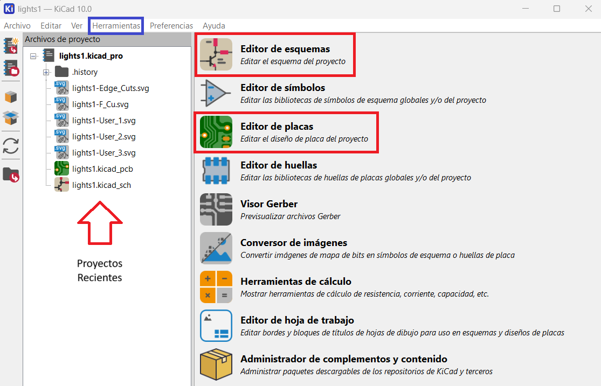

La imagen anterior muestra la página principal de KiCad, la cual cuenta con 4 secciones importantes: Proyectos Recientes, Editor de Esquemáticos, Editor de Placas y Herramientas. Estas son las 4 secciones principales que se van a utilizar.

## Herramientas
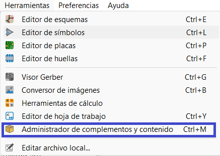

La sección de Herramientas nos permite, mediante el Administrador de Complementos y Contenido, añadir más opciones de componentes a nuestros diseños esquemáticos. Esto nos da acceso a un catálogo amplio y variado de recursos, útiles para nuestros proyectos.

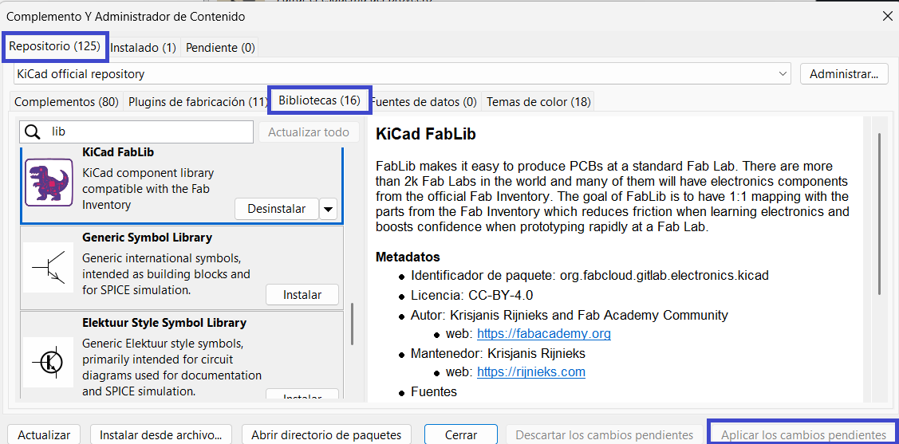

Esto lo vamos a lograr accediendo a la sección de Repositorios, luego a Bibliotecas, donde debemos buscar la biblioteca "KiCad FabLib". La instalamos entrando a ese repositorio, dando clic en donde diga "Instalar", y luego en "Aplicar Cambios Pendientes". Después solo debemos reiniciar la aplicación y los nuevos recursos ya se verán añadidos en la sección de esquemáticos.

## Editor de Esquemáticos

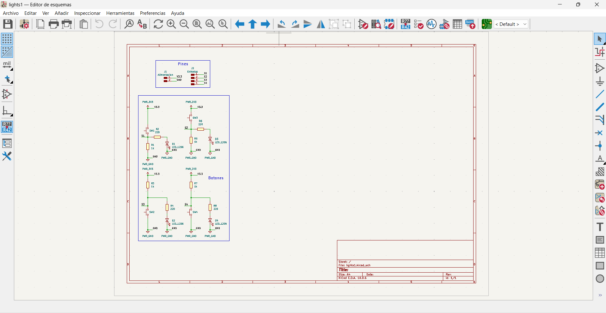
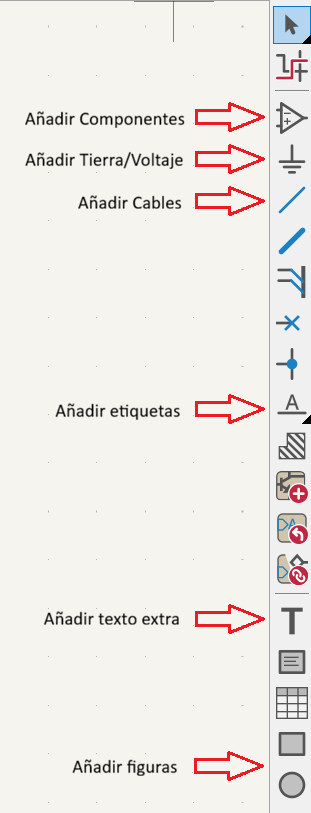

Al entrar a la página de esquemáticos, nos encontraremos con la barra lateral a la izquierda, que nos permitirá cumplir con todas las funciones presentadas en la imagen.

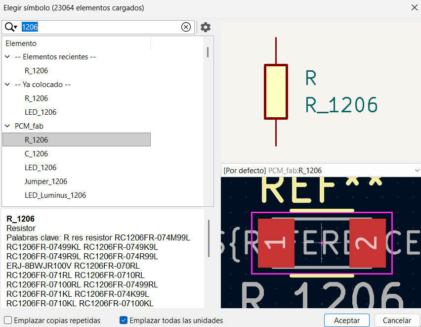

Lo recomendado dentro de nuestros proyectos es que, por nuestro poco conocimiento en soldadura y en componentes pequeños (que son los que normalmente se necesitan para las PCB), usemos un tamaño de 1206 en los componentes. Esto nos ayuda porque, dentro de los recursos ya instalados en el FabLib, podemos simplemente buscar "1206" y nos aparecerán los componentes de la biblioteca con ese tamaño.

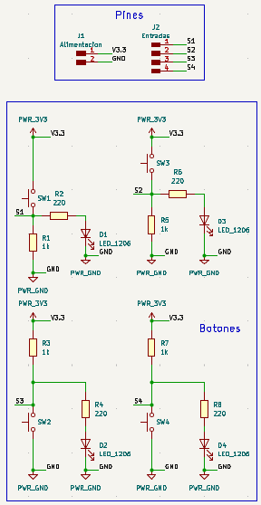
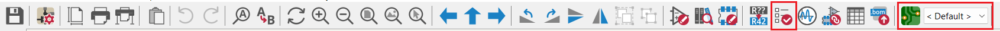

Al final, debe quedar un resultado similar al presentado anteriormente, en donde todo esté conectado en el esquemático ideal, los componentes estén etiquetados, los pines de entrada y salida estén establecidos, y los voltajes y tierras definidos.Y cuando el resultado sea el deseado, se debe dar clic en el ícono de checklist en la barra superior para correr un ERC, el cual comprobará errores dentro del esquemático; de estos, los únicos esperados deberían ser que las tierras y voltajes no están conectados a nada. Teniendo esto en cuenta, y ya cuando esa parte esté terminada, se hace clic en el ícono de hasta la derecha para pasar del esquemático al editor de placas.

## Editor de Placas

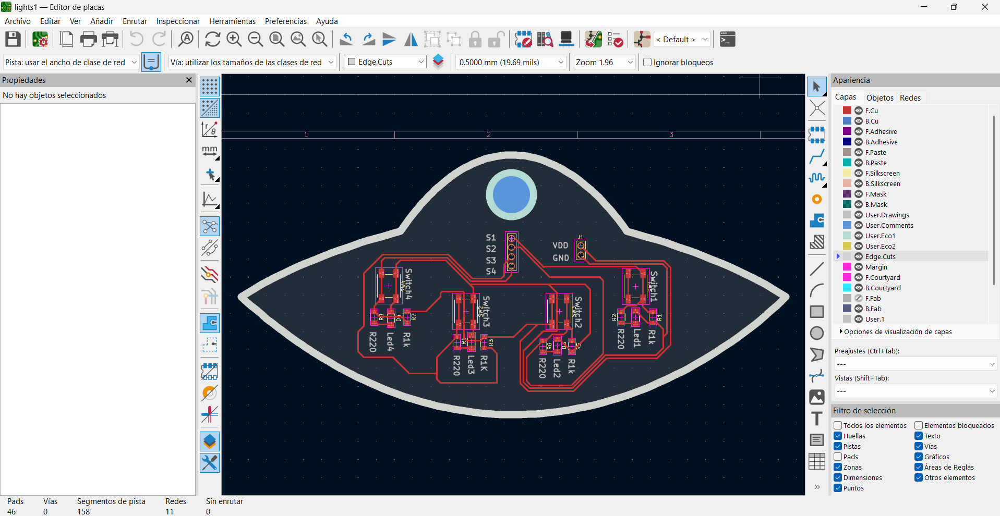

La imagen anterior muestra cómo se ve la página principal del editor de placas. En esta página, al iniciar, todos los componentes van a estar juntos, y estos se pueden acomodar de la forma en que se desee que la placa se vea al final. Pero antes de empezar a conectar, se deben tomar en cuenta las tolerancias y la medida de las pistas.

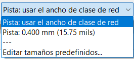
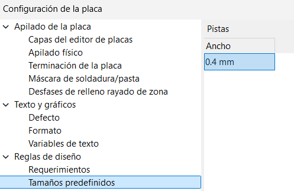
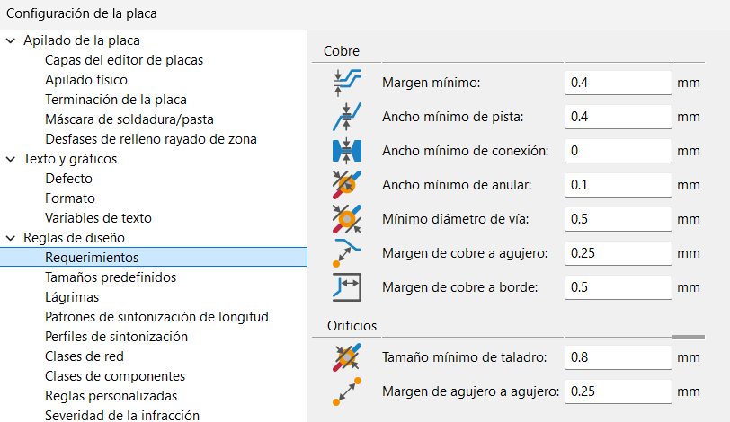

En la esquina superior izquierda, se va a ver un menú que va a decir "Pista: usar el ancho de clase de red". Al abrir ese menú, se puede desplegar para modificar las configuraciones que la placa debe tener, las cuales son: mínimo 0.4 mm de pista, 0.4 mm mínimo de margen, y 0.8 mm mínimo de taladro. Estos son los únicos valores que se deben modificar en los menús de configuración.

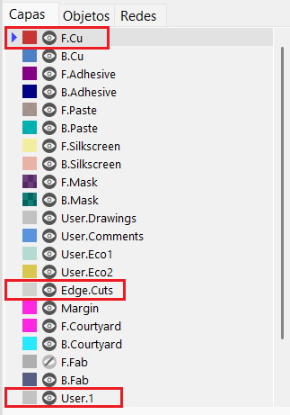
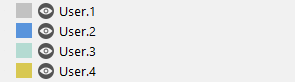

Lo primero importante de mencionar es la importancia de las capas. Por cada capa, se deben hacer distintas cosas: en la capa de Edge Cuts deberían ir los contornos, en F.Cu las pistas, etc. Esto es así para que, cuando se deba mandar a cortar la placa, se haga distinción entre los diferentes tipos de corte.

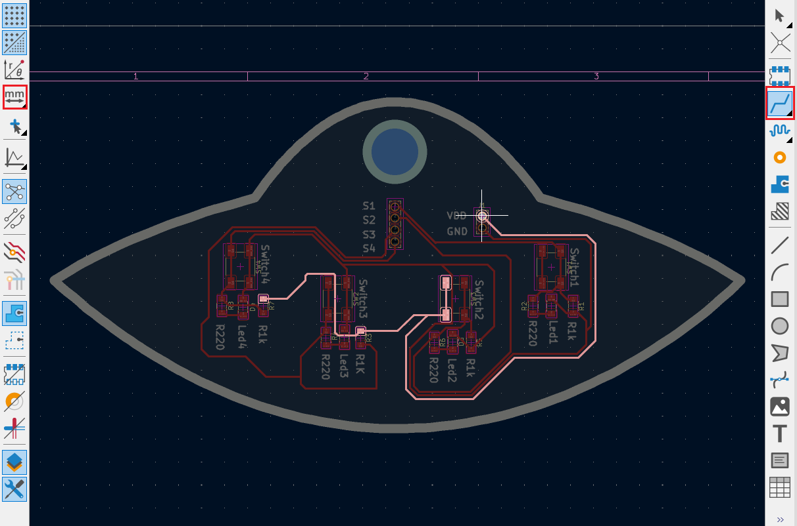

Después, dentro de la capa de F.Cu, se hacen las pistas ya con las configuraciones previamente hechas. La ventaja de esta aplicación es que, al seleccionar un componente desde cualquiera de sus lados, se va a marcar el camino hacia los elementos con la misma conexión, mostrando cómo las pistas se deben conectar unas con otras.

Del lado izquierdo, se debe cambiar la configuración para que diga "mm" (milímetros), y del lado derecho va a haber un ícono para la selección de pistas.

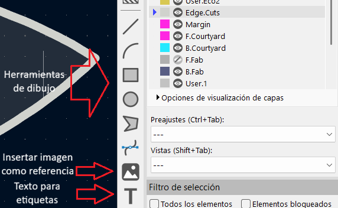

En Edge Cuts se le da la forma que se desee a la placa; en User 1 se colocan las etiquetas de los componentes, y en User 2 se ponen los agujeros necesarios para entradas y salidas. Las demás capas User también se pueden utilizar para algún otro agujero o cualquier otra cosa que se requiera.

IMPORTANTE:

- Contornos: 2 mm
  
- Pistas: 0.4 - 0.6 mm
  
- Etiquetas: 0.4 - 0.6 mm
