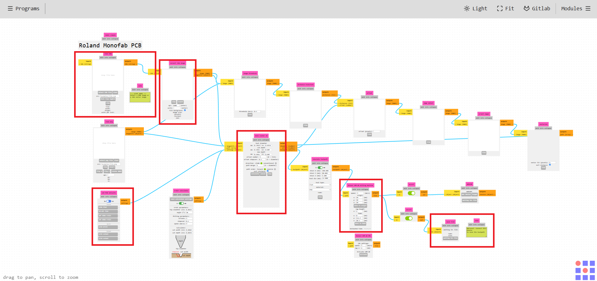
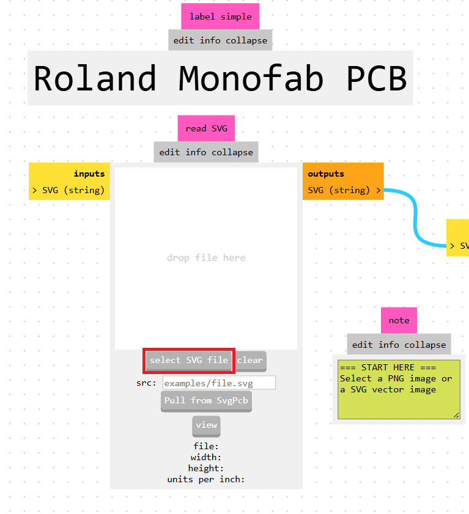
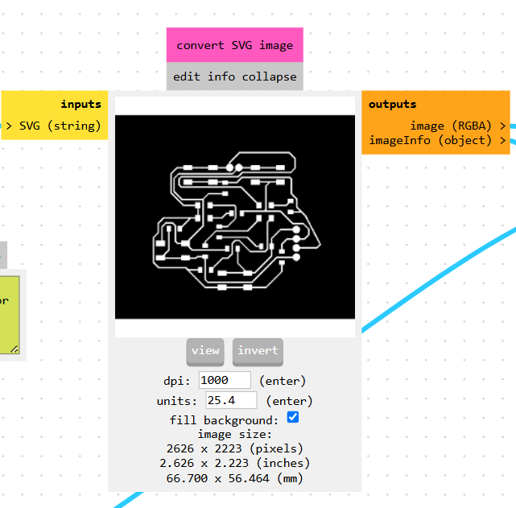
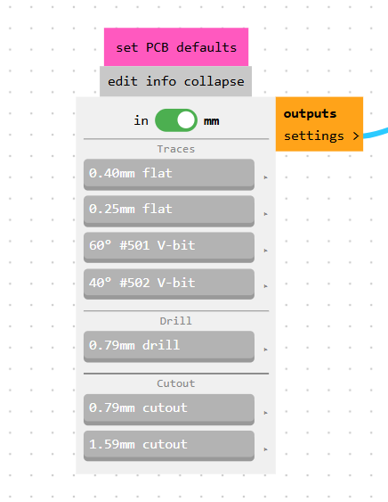
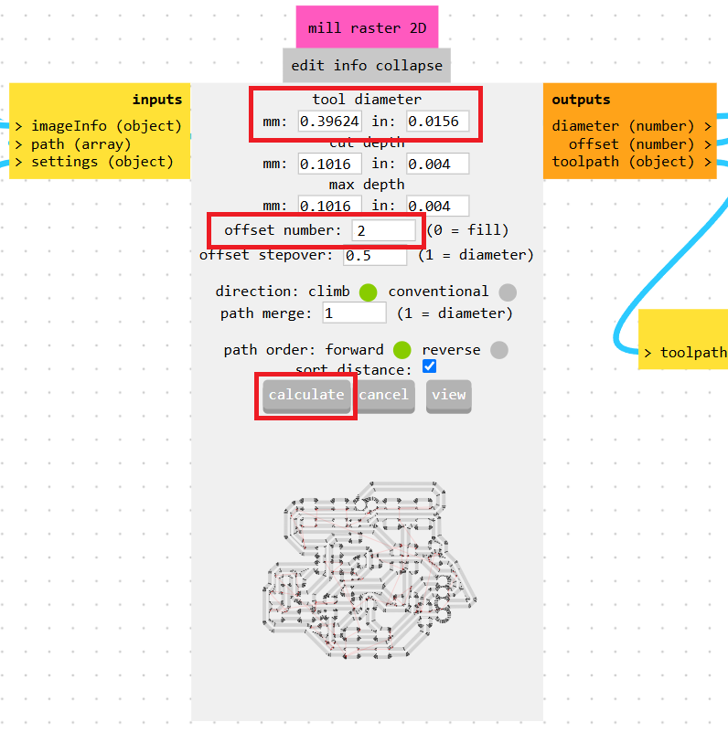
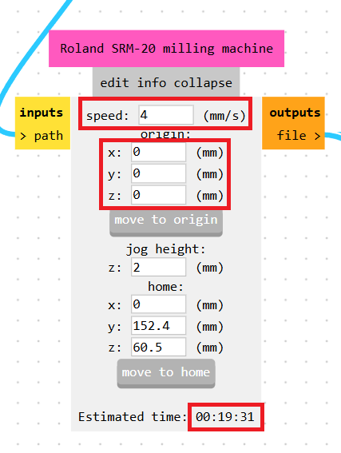
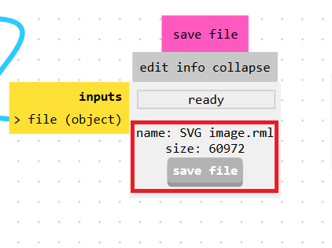

{ width="1000" style="display: block; margin: 0 auto;" }

MODS CE es una bifurcación del proyecto de investigación de CBA mods. Mods es una herramienta modular multiplataforma para laboratorios de fabricación (fablabs). Está basada en módulos independientes pero interrelacionados. Mods podría utilizarse potencialmente para CAD, CAM, control de máquinas, automatización, creación de interfaces de usuario (UI), lectura de dispositivos de entrada, reacción a modelos físicos y mucho más. Las posibilidades son infinitas.

El objetivo de esta edición es proporcionar documentación, soporte y ayudar a la comunidad a involucrarse en el proyecto y fomentar el desarrollo/intercambio de nuevos módulos.

{ width="600" style="display: block; margin: 0 auto;" }

{ width="600" style="display: block; margin: 0 auto;" }

Para insertar un archivo, dirígete a la sección encargada de leer el formato SVG. Una vez seleccionado, podrás ajustar diferentes parámetros más adelante.

Es muy importante tener en cuenta que todo lo que aparezca de color negro en el archivo será la zona donde la máquina realizará el corte. Por lo tanto, si las pistas no se muestran correctamente como en la imagen de referencia, deberás invertir el documento. Del mismo modo, asegúrate de que, para perforaciones o contornos, únicamente aquello que desees que la máquina corte se encuentre en color negro.

{ width="400" style="display: block; margin: 0 auto;" }

En el siguiente paso, se debe seleccionar la herramienta adecuada según el tipo de corte y la fresa que se vaya a utilizar. Tambien se debe de asegurar que las medidas esten en mm, no en in.

{ width="600" style="display: block; margin: 0 auto;" }

A continuación, en la parte superior se mostrará el tamaño de la fresa y de las herramientas, valores que no se deben modificar. Después, en la sección de offsets, únicamente los archivos de las pistas y etiquetas (o aquellos que utilicen la herramienta de 0.4 mm) deben ajustarse a 2 offsets; el resto se deja con su valor predeterminado. Por último, se hace clic en "calculate" para que la plataforma genere los archivos de corte.

{ width="400" style="display: block; margin: 0 auto;" }

La velocidad de trabajo de la cortadora es un parametro muy importante, asi no existe el riesgo de romper la punta por demasiada velocidad, especialmente en las perforaciones en la PCB.

Para contorno (Fresa de 2 mm), pistas y etiquetas (Fresas de 0.4 mm) la velocidad recomendada es 4 mm/s.

Para perforaciones (Fresa de 0.8 mm) la velocidad recomendada es de 0.2 a 0.4 mm/s.

Despues, puede cambiar el origen de la cortadora directamente en el mods, es necesario cambiarlo manualmente a un origen (0,0,0) ya que el mods automáticamente lo pone en (10,10,10). En la mayoría de los casos vas a querer un origen (0,0,0), a menos que vayas a hacer muchos cortes a la vez, como lo puede ser más de una pcb.

{ width="400" style="display: block; margin: 0 auto;" }

Finalmente, una vez realizados todos estos cambios, se busca el recuadro correspondiente para exportar y guardar el documento en formato SVG.
