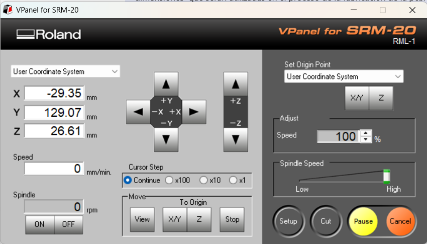
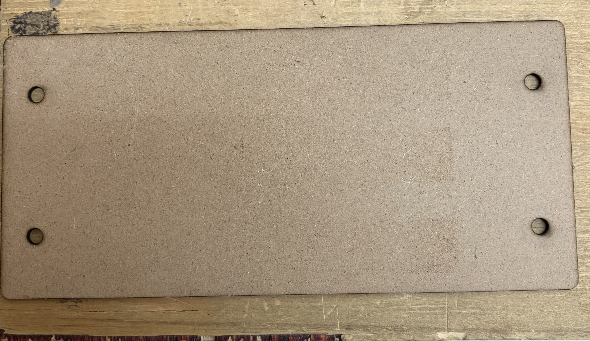
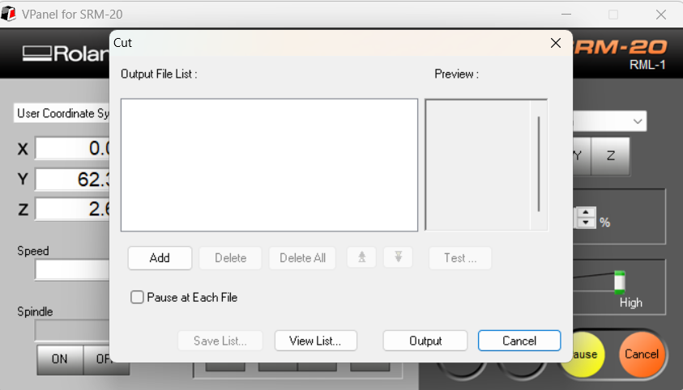

{ width="800" style="display: block; margin: 0 auto;" }

{ width="600" style="display: block; margin: 0 auto;" }

El VPanel es el software de control virtual para la máquina monoFab, funciona como el panel de mando en la computadora para poder operarla manualmente. Desde este programa se realizan los ajustes principales antes de mandar a cortar, como mover la herramienta sobre los ejes para establecer el punto de origen (0,0,0) y cargar los archivos de corte generados.

Para comenzar primero se configurará el origen en X y Y. Nos movemos con el panel de navegación de ejes hasta comprobar visualmente que la herramienta está cercana a la esquina inferior izquierda. Podemos configurar la velocidad a la que se mueve la fresa en la sección de "Cursor Step", donde hay opción para que el movimiento sea continuo o en pequeños pasos con las velocidades x100, x10 y x1. Después de mover al lugar deseado, se pulsa el botón de la parte derecha que dice "X/Y" y saldrá un aviso para confirmar si se quiere configurar el nuevo origen de X y Y en ese punto, el cual se acepta.

Después se comienza a configurar el origen en Z. Al colocar este origen se debe tener cuidado: primero pondremos a girar el motor de la fresa con el botón que dice "ON" en la esquina inferior izquierda. Ya que esté girando, debemos bajar cuidadosamente la fresa hasta rozar la placa PCB; necesitamos rayar ligeramente la placa, no atravesarla (se puede comprobar visualmente cuando empieza a salir polvo). En cuanto la fresa esté rayando la PCB, paramos el spindle con el botón de "OFF", y fijamos el origen en Z pulsando el botón que dice "Z" en la parte derecha.

{ width="800" style="display: block; margin: 0 auto;" }

Cuando el origen esté bien configurado, le damos a "CUT" en la esquina inferior derecha, se sube el archivo que vayamos a cortar y dejamos a la máquina trabajar.

El orden de corte recomendado es:
Perforaciones: con la fresa de 0.8 mm.
Pistas y etiquetas: con la fresa de 0.4 mm.
Contorno de la PCB: con la fresa de 2.0 mm.

Es importante mencionar que cuando acabe el corte, se debe cambiar la fresa de acuerdo al corte que se va a realizar proximamente, por lo cual el eje Z se debe de configurar cada vez que se cambie la fresa.
