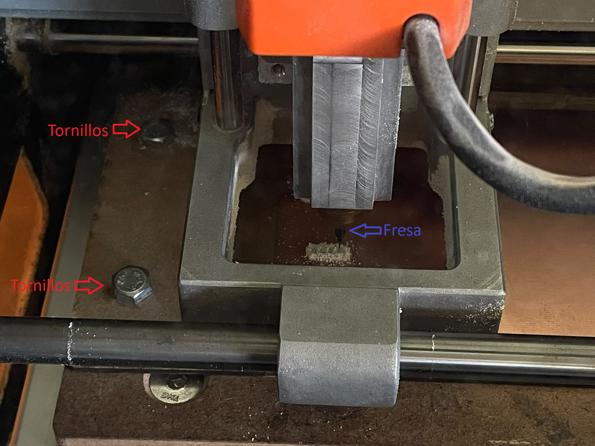
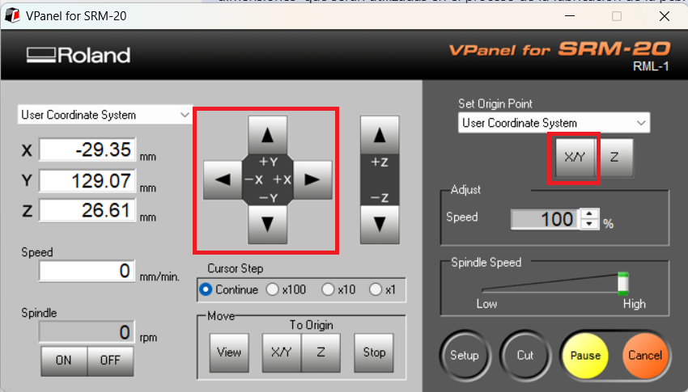
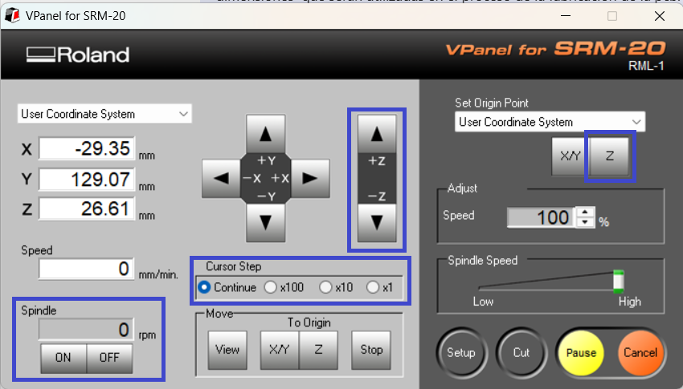
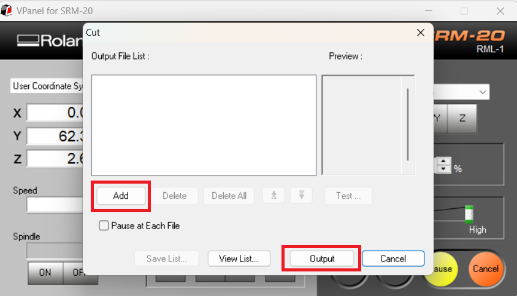

{ width="800" style="display: block; margin: 0 auto;" }

{ width="800" style="display: block; margin: 0 auto;" }

El VPanel es el software de control virtual para la máquina monoFab y funciona como el panel de mando en la computadora para operarla manualmente. Desde este programa se realizan los ajustes principales antes de enviar a cortar, tales como mover la herramienta sobre los ejes para establecer el punto de origen (0, 0, 0) y cargar los archivos de mecanizado.

Sin embargo, antes de mover la máquina, se debe preparar la placa de sacrificio: fija la PCB firmemente a su superficie utilizando cinta doble cara para garantizar que no se suelte durante el corte. La placa cuenta con perforaciones en sus cuatro esquinas para poder atornillarla de forma segura a la cama de la MonoFab. Finalmente, utilizando una llave Allen, coloca o cambia las fresas necesarias para que el equipo quede listo para la operación.

{ width="800" style="display: block; margin: 0 auto;" }

A continuación, se procede a configurar el origen en Z. Este paso requiere precaución: primero, enciende el motor de la fresa haciendo clic en el botón "ON" ubicado en la esquina inferior izquierda. Con la fresa girando, bájala con cuidado hasta rozar la placa PCB. El objetivo es rayar ligeramente la superficie sin atravesarla (lo cual se comprueba visualmente cuando comienza a soltar polvo).

Para evitar accidentes y no romper la herramienta, ajusta la velocidad de desplazamiento utilizando los selectores "Continuo, x100, x10, x1"; de este modo, los movimientos serán cada vez más lentos conforme te acerques a la base, reduciendo el riesgo de dañar la placa o la fresa. Tan pronto como la fresa empiece a marcar la PCB, apaga el spindle con el botón "OFF" y fija el origen en Z presionando el botón "Z" situado en el panel derecho.

{ width="800" style="display: block; margin: 0 auto;" }

Después se comienza a configurar el origen en Z. Al colocar este origen se debe tener cuidado: primero pondremos a girar el motor de la fresa con el botón que dice "ON" en la esquina inferior izquierda. Ya que esté girando, debemos bajar cuidadosamente la fresa hasta rozar la placa PCB; necesitamos rayar ligeramente la placa, no atravesarla (se puede comprobar visualmente cuando empieza a salir polvo). Tambien hay que asegurarse que, para no romper la fresa, se deben cambiar las velocidades con los botones "Continuo, x100, x10, x1", esto para que cuanto mas nos vayamos acercando a la base, lo mas lento que son los movimientos para que no corramos riesgo de romper o la placa o nuestras herramientas. En cuanto la fresa esté rayando la PCB, paramos el spindle con el botón de "OFF", y fijamos el origen en Z pulsando el botón que dice "Z" en la parte derecha.

{ width="800" style="display: block; margin: 0 auto;" }
{ width="800" style="display: block; margin: 0 auto;" }

Una vez que los orígenes estén configurados correctamente, haz clic en "CUT" en la esquina inferior derecha. En la nueva ventana, selecciona y carga el archivo que deseas cortar y presiona "Output" para que la máquina comience a trabajar.

El orden de corte recomendado es el siguiente:

Perforaciones: utilizando la fresa de 0.8 mm.

Pistas y etiquetas: utilizando la fresa de 0.4 mm.

Contorno de la PCB: utilizando la fresa de 2.0 mm.

Finalmente, es importante recordar que al finalizar cada etapa de corte se debe cambiar la fresa según corresponda para la siguiente tarea, por lo que el eje Z deberá configurarse nuevamente cada vez que se realice un cambio de herramienta.
