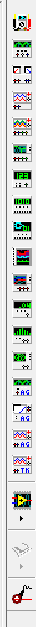

{ width="250" style="display: block; margin: 0 auto;" }

KiCad es un programa gratuito y de código abierto que se usa para diseñar componentes electrónicos, desde los esquemáticos hasta las placas de circuito impreso (PCB). Es una de las herramientas más usadas en el mundo de la electrónica, tanto por su facilidad de uso como por ser completamente gratuita. A continuación, se detalla paso a paso cómo utilizarla.

## Introducción a Multisim

{ width="1000" style="display: block; margin: 0 auto;" }

## Herramientas

{ width="800" style="display: block; margin: 0 auto;" }

La sección de Herramientas nos permite ampliar las capacidades del software mediante el Administrador de Complementos y Contenido, dándonos acceso a un catálogo amplio y variado de recursos muy útiles para nuestros proyectos.

{ width="350" style="display: block; margin: 0 auto;" }
