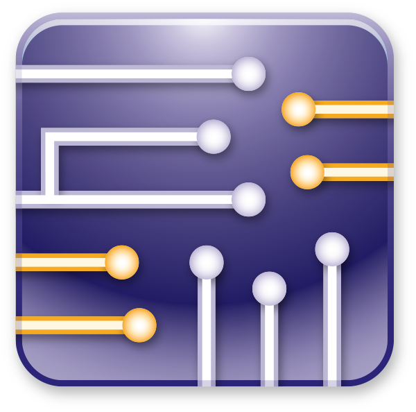
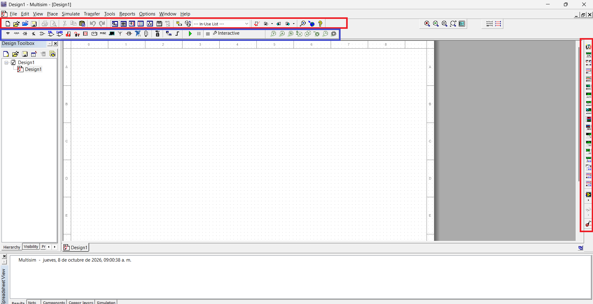
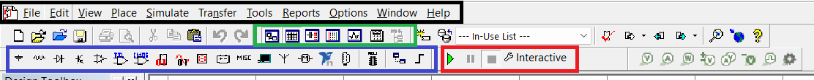
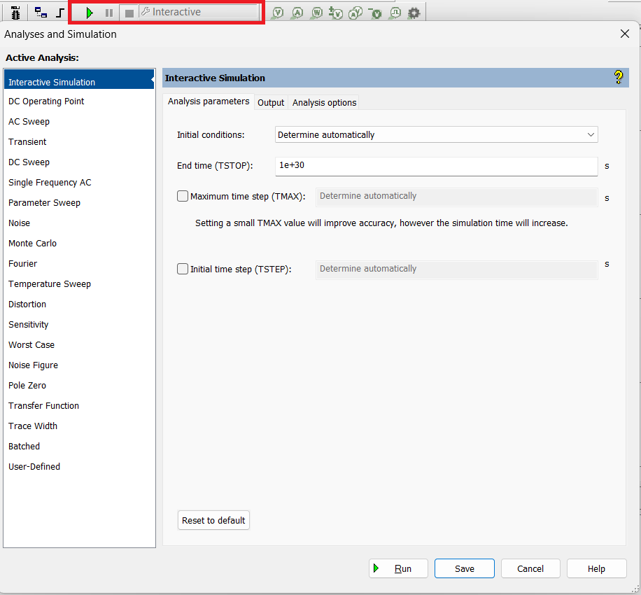
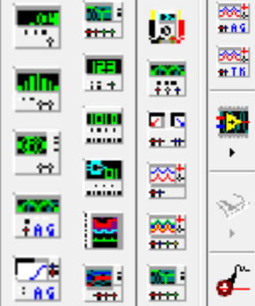

{ width="250" style="display: block; margin: 0 auto;" }

El software simulador de circuitos Multisim™ integra la simulación SPICE con un entorno esquemático interactivo para visualizar y analizar de forma instantánea el comportamiento de los circuitos electrónicos. Al agregar una potente simulación y análisis de circuitos al flujo de diseño, Multisim™ ayuda a los investigadores y diseñadores a reducir las iteraciones de tarjeta de circuito impreso prototipos (PCB) y ahorrar costos de desarrollo.

## Introducción a Multisim

{ width="1000" style="display: block; margin: 0 auto;" }

Al iniciar Multisim, encontramos tres áreas principales: la pantalla de trabajo, la barra de herramientas horizontal en la parte superior y la barra de herramientas vertical a la derecha.

## Herramientas Superiores

{ width="800" style="display: block; margin: 0 auto;" }

En la barra horizontal superior se encuentran diversas funciones. En el recuadro azul están todos los componentes que se pueden insertar y conectar, mientras que en el recuadro rojo se configuran las distintas simulaciones disponibles, según los estudios que se requieran.

{ width="800" style="display: block; margin: 0 auto;" }

Después están las funciones habituales de guardar y configurar y, en la parte superior, se pueden encontrar funciones adicionales según las necesidades del proyecto.

## Herramientas Laterales

{ width="600" style="display: block; margin: 0 auto;" }

En la barra lateral derecha se encuentran diversas herramientas para profundizar en el análisis, como osciloscopios, multímetros y otros instrumentos de medición.
