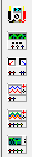
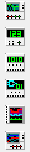
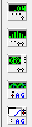
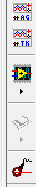

{ width="250" style="display: block; margin: 0 auto;" }

El software simulador de circuitos Multisim™ integra la simulación SPICE con un entorno esquemático interactivo para visualizar y analizar de forma instantánea el comportamiento de los circuitos electrónicos. Al agregar una potente simulación y análisis de circuitos al flujo de diseño, Multisim™ ayuda a los investigadores y diseñadores a reducir las iteraciones de tarjeta de circuito impreso prototipos (PCB) y ahorrar costos de desarrollo.

## Introducción a Multisim

{ width="1000" style="display: block; margin: 0 auto;" }

Al iniciar Multisim, tenemos tres paneles principales, la pantalla principal, la taskbar horizontal en la parte superior, y la taskbar vertical a la derecha.

## Herramientas

{ width="800" style="display: block; margin: 0 auto;" }

En la barra horizontal superior, encontramos diferentes funciones. En el recuadro azul se encuentran todos los componentes que se pueden insertar y conectar. En el recuadro rojo se configuran las difgerentes simulaciones que se pueden hacer dependiendo de los doferentes estudios que sean necesarios.

{ width="800" style="display: block; margin: 0 auto;" }

Despues estan las funciones normales de guardar y configurar, y en la parte superior se pueden encontrar funciones extras dependiendo de las necesidades del proyecto.

{ width="200" style="display: block; margin: 0 auto;" }
{ width="200" style="display: block; margin: 0 auto;" }
{ width="200" style="display: block; margin: 0 auto;" }
{ width="200" style="display: block; margin: 0 auto;" }
