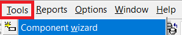
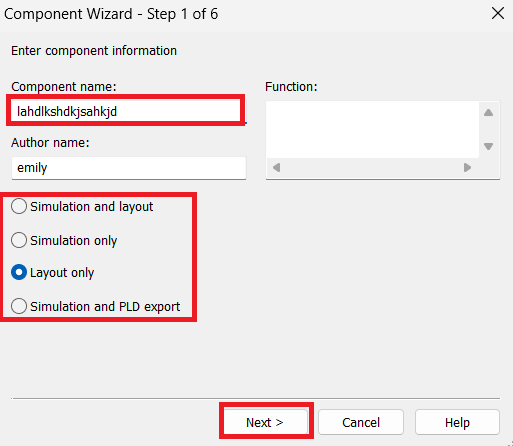
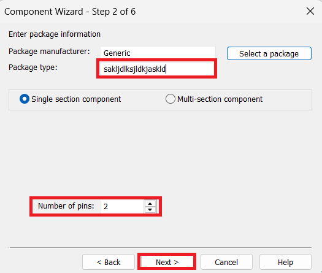
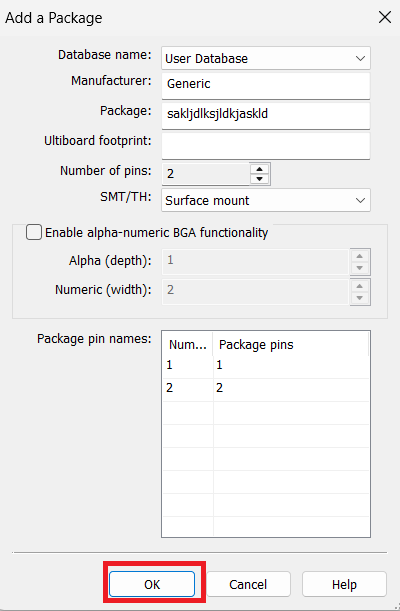
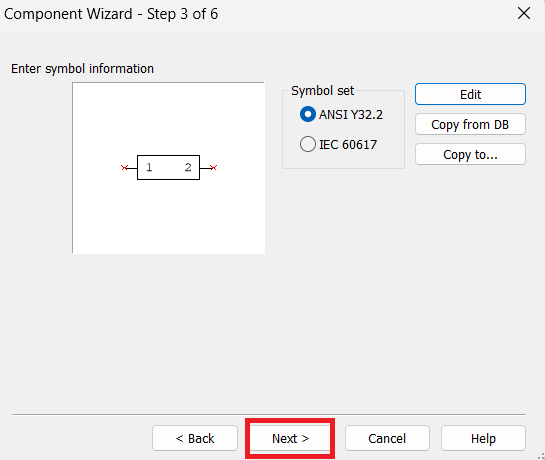
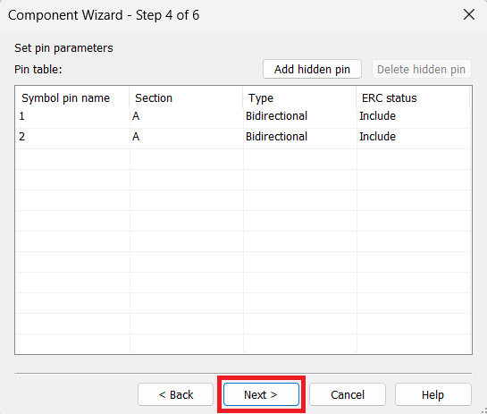
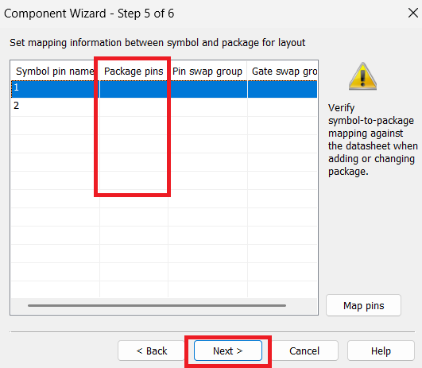
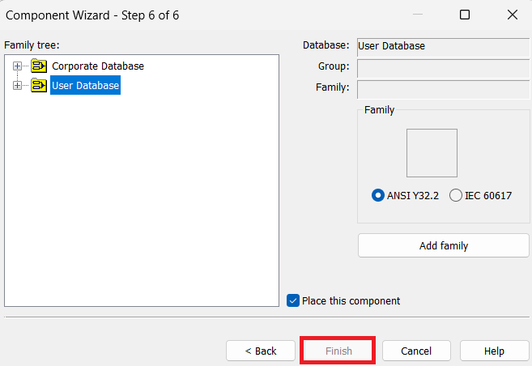

{ width="250" style="display: block; margin: 0 auto;" }

El software simulador de circuitos Multisim™ integra la simulación SPICE con un entorno esquemático interactivo para visualizar y analizar de forma instantánea el comportamiento de los circuitos electrónicos. Al agregar una potente simulación y análisis de circuitos al flujo de diseño, Multisim™ ayuda a los investigadores y diseñadores a reducir las iteraciones de tarjeta de circuito impreso prototipos (PCB) y ahorrar costos de desarrollo.

## Introducción a Multisim

{ width="1000" style="display: block; margin: 0 auto;" }

Al iniciar Multisim, la interfaz se divide en tres áreas principales: la pantalla de trabajo, donde se arma y se visualiza el circuito; la barra de herramientas horizontal, ubicada en la parte superior; y la barra de herramientas vertical, situada del lado derecho. Conocer la función de cada una de estas áreas es el primer paso para trabajar de forma ordenada y aprovechar mejor el programa.

## Herramientas Superiores

{ width="800" style="display: block; margin: 0 auto;" }

La barra horizontal superior concentra diversas funciones esenciales para el desarrollo de un proyecto. En el recuadro azul se encuentran todos los componentes que pueden insertarse y conectarse en el circuito, como resistencias, capacitores, fuentes y otros elementos. Por su parte, en el recuadro rojo se configuran las distintas simulaciones disponibles, que se eligen según el tipo de estudio que se necesite realizar sobre el circuito.

{ width="800" style="display: block; margin: 0 auto;" }

Además de lo anterior, se encuentran las funciones habituales de guardar y configurar el proyecto. En la parte superior también se ubican opciones adicionales que pueden resultar útiles dependiendo de las necesidades específicas de cada diseño.

## Herramientas Laterales

{ width="600" style="display: block; margin: 0 auto;" }

La barra lateral reúne diversas herramientas que permiten profundizar en el análisis del circuito. Entre ellas se encuentran instrumentos virtuales como el osciloscopio y el multímetro, además de otros aparatos de medición y análisis. Gracias a ellos es posible observar con detalle el comportamiento de las señales, comprobar voltajes y corrientes, y validar que el circuito funcione como se espera antes de pasar a la etapa de construcción.

## Componentes Personalizados

Una de las fiunciones extras que tiene Multisim es que, si no esta el componente que uno busca, lo puede agregar.

### 1. Component Wizard
{ width="600" style="display: block; margin: 0 auto;" }
{ width="600" style="display: block; margin: 0 auto;" }
{ width="600" style="display: block; margin: 0 auto;" }
{ width="600" style="display: block; margin: 0 auto;" }
{ width="600" style="display: block; margin: 0 auto;" }
{ width="600" style="display: block; margin: 0 auto;" }
{ width="600" style="display: block; margin: 0 auto;" }
{ width="600" style="display: block; margin: 0 auto;" }
